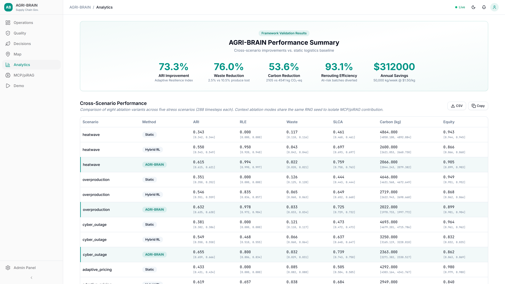

# AGRI-BRAIN

An adaptive supply-chain intelligence system combining PINN-based spoilage
prediction, LSTM demand forecasting, Social Life-Cycle Assessment (SLCA),
multi-agent coordination, MCP-mediated tool interoperability, physics-informed
RAG knowledge retrieval, and regime-aware contextual policy with online
REINFORCE learning for sustainable food logistics.

## Frontend Screenshots

| Operations Dashboard | Quality Monitoring | Supply Chain Map |
|:---:|:---:|:---:|
|  |  |  |

| Decisions Timeline | Analytics | Admin Panel |
|:---:|:---:|:---:|
|  |  |  |

| Admin Blockchain | Admin Scenarios |
|:---:|:---:|
|  |  |

| Explainability Panel | MCP Tools | MCP Resources |
|:---:|:---:|:---:|
|  |  |  |

| MCP Invocation | piRAG Search |
|:---:|:---:|
|  |  |

| MCP/piRAG Overview | Context Features | Knowledge Base |
|:---:|:---:|:---:|
|  |  |  |

| Protocol & Traces | Causal Reasoning |
|:---:|:---:|
|  |  |

| System Walkthrough | Heatwave Scenario |
|:---:|:---:|
|  |  |

> **Scenario GIFs**: See `docs/screenshots/agent-theater-*.gif` for animated walkthroughs of all 5 agents processing heatwave, overproduction, cyber outage, adaptive pricing, and baseline scenarios.

## Architecture Highlights

- **MCP interoperability layer** with 13 statically registered tools and 5 additional
  runtime role-capability tools (18 at simulation time), plus 13 resources and 5 prompts,
  accessible through JSON-RPC 2.0 protocol with InProcess, Stdio, and SSE transports
- **Physics-informed RAG (piRAG)** with 20-document knowledge base, BM25+TF-IDF hybrid
  retrieval (k=4, 20% retrieval ratio), physics-aware query expansion,
  and physics-aware reranking (temperature-proximity scoring, spoilage-
  stage keyword density, urgency cues; the upstream Arrhenius decay
  rate is supplied as input for query expansion rather than evaluated
  inside the reranker). Earlier revisions of this README labelled the
  reranker "Arrhenius-based" — the new wording reflects what the code
  actually computes.
- **Causal explanation engine** producing BECAUSE/WITHOUT reasoning with inline [KB:]
  citations, counterfactual probability comparisons, and Merkle-rooted provenance chains
- **8 canonical operating modes** plus 7 §4.7 sensitivity ablations
  (15 total): static, hybrid RL, no PINN, no SLCA, no context, MCP
  only, piRAG only, full AGRI-BRAIN, plus `agribrain_cold_start` and
  `agribrain_pert_{10,25,50}` (with-learning) and
  `agribrain_pert_{10,25,50}_static` (no-learning) for the prior-
  sensitivity story. The 8-mode count refers to the canonical
  publication ablation; the 15-mode set drives the §4.7 supplementary
  analysis.
- **LSTM demand forecaster** (numpy-only, 16 hidden units, truncated
  BPTT) with in-sample residual-standard-deviation prediction
  uncertainty. Holt's linear (double exponential smoothing) demand
  fallback available via `FORECAST_METHOD` env var.
- **Holt's linear yield/supply forecaster** (level + trend, no
  seasonal component) for inventory projection, with matching
  residual-std uncertainty. Earlier revisions of this README labelled
  this "Holt-Winters", but the implementation is the level+trend form
  of Holt 1957; no seasonal indices are computed. Both forecasts feed
  symmetrically into the state vector phi(s) at indices 6-8 (supply
  point, supply uncertainty, demand uncertainty).
- **5-agent coordinator** (Farm, Processor, Cooperative, Distributor, Recovery)
  dispatching decisions at lifecycle-stage boundaries
- **Context feature integration** via 5D institutional context vector
  (compliance severity, forecast urgency, retrieval confidence, regulatory
  pressure, recovery saturation) with learned Θ_context ∈ ℝ^(3×5) weight matrix
  and SLCA bonus amplification
- **MCP governance override** that mandates rerouting under simultaneous critical
  compliance violation and high spoilage forecast
- **Online REINFORCE learning** of context weights with sign constraints preserving
  domain-justified directions while adapting magnitudes to scenario conditions
- **Operational feasibility diagnostics** with decision latency and constraint violation
  rates reported per scenario/method for process-systems interpretation
- **Dual-mode stochastic simulation** with 8 field-realistic uncertainty sources:
  sensor noise (tempC ±2.5°C, RH ±7%), demand variability (CV 25%), inventory/yield
  uncertainty (CV 22%), transport distance jitter (CV 22%), spoilage model error
  (k_ref CV 20%, Ea_R CV 14%), scenario onset timing jitter (±6h), policy weight
  perturbation (sigma 0.15), and per-(mode, seed) policy-temperature
  heterogeneity (LogNormal sigma 0.25). Produces meaningful CIs,
  p-values, and effect sizes across 20 benchmark seeds; set
  `DETERMINISTIC_MODE=true` for audit mode.
- **Robustness + significance toolkit** including multi-seed stress
  tests (sensor noise, missing telemetry, delay, MCP fault injection,
  compounded), pair-aware test selection (Wilcoxon signed-rank for
  paired comparisons, Mann-Whitney U for unpaired), Holm-Bonferroni
  primary-family correction, Benjamini-Yekutieli FDR for the secondary
  family, bootstrap CI on every Cohen's d, and Hedges' g small-sample
  correction.
- **Keyword extraction** from piRAG passages (thresholds, regulatory references,
  required actions) for human-readable decision evidence.
- **MCP JSON-RPC** dispatch with protocol recording. The simulator
  runs MCP through a deterministic in-process JSON-RPC transport
  (`InProcessTransport`) for full per-step reproducibility; the same
  dispatcher exposes `StdioTransport` and `SSETransport` for
  external-client integration.
- **Circular economy scoring** for composting, animal feed, food bank pathways.
- **Arrhenius-Baranyi spoilage ODE with a physics-informed neural
  residual correction** trained under an ODE-residual penalty
  (see `agri-brain-mvp-1.0.0/backend/src/models/pinn_net.py`).
- **Softmax contextual policy** with 10-dimensional state feature vector
  (perception + symmetric supply and demand forecast channels +
  demand-volatility price-pressure proxy) and 5-dimensional
  institutional context modifier.
- **Permissioned-EVM audit trail** via Hardhat/Solidity smart contracts
  with role-gated agent registration, append-only provenance, persisted
  episode roots, key-whitelisted policy store, and reentrancy-guarded
  governance (`AgentRegistry`, `DecisionLogger`, `PolicyStore`,
  `ProvenanceRegistry`, `SLCARewards`, `AgriDAO`).

## Frontend

Modern React dashboard built with shadcn/ui, featuring eight pages:

| Page | Description |
|------|-------------|
| **Operations** | KPI bento grid, real-time telemetry charts with temperature zones, spoilage & yield preview |
| **Quality** | Circular spoilage risk gauge, shelf-life countdown, IoT sensor charts, PINN vs ODE comparison |
| **Decisions** | Timeline view with role/action filters, decision cards with expandable MCP/piRAG explainability panels (causal BECAUSE/WITHOUT reasoning, 5-axis context feature radar chart, extracted keyword tags, Merkle-rooted provenance chains), analytics sidebar with pie chart, CSV/PDF export |
| **Map** | Leaflet map of South Dakota supply chain nodes with route overlays and live KPI popups |
| **Analytics** | Executive summary banner, interactive cross-scenario tables & charts, ablation study, radar profiles, scenario deep-dive gallery, carbon footprint analysis |
| **MCP/piRAG** | MCP protocol overview, context feature visualization, knowledge base browser, protocol traces, causal reasoning panel |
| **Demo** | Interactive system demo with live pipeline walkthrough and agent decision theater |
| **Admin** | Seven tabs — Policy parameters, Blockchain status & config, Audit log, Scenario runner, Quick Decision, Runtime config, MCP Explorer (tool browser with 13 statically registered tools, live resource monitor, prompt template browser, live tool invocation with presets, piRAG knowledge base search, JSON-RPC protocol interaction log) |

**Tech stack:** React 18, React Router 7, shadcn/ui (Radix), Tailwind CSS, Recharts, React-Leaflet, Framer Motion, Sonner toasts, Vite 7

## Quick Start

The commands below assume the repository is cloned as ``AGRI-BRAIN``
(the default ``git clone`` directory). If you cloned into a different
directory name, substitute that name wherever ``AGRI-BRAIN`` appears.

### Backend (port 8100)

```bash
cd AGRI-BRAIN
python -m venv .venv
source .venv/bin/activate          # Linux / macOS
# .venv\Scripts\activate           # Windows (cmd)
# .venv\Scripts\Activate.ps1       # Windows (PowerShell)
pip install -e agri-brain-mvp-1.0.0/backend
python -m uvicorn src.app:API --port 8100 --app-dir agri-brain-mvp-1.0.0/backend
```

### Frontend (port 5173)

```bash
cd agri-brain-mvp-1.0.0/frontend
npm install
npm run dev
```

### Load data and verify

```bash
curl -X POST http://localhost:8100/case/load    # Load sensor CSV
curl http://localhost:8100/health                # {"ok":true}
```

- Dashboard: http://localhost:5173
- Admin panel: http://localhost:5173/admin
- API docs: http://localhost:8100/docs

### Simulation

```bash
cd mvp/simulation
python generate_results.py    # 5 scenarios x 8 modes (40 episodes)
python generate_figures.py    # publication figures (Fig. 2-10, PNG + PDF)
```

### HPC benchmark

The 20-seed stochastic benchmark (5 × 9 × 20 = 900 episodes plus aggregation
and figure generation) is submitted through three SLURM scripts at the repo
root. From the HPC login node:

```bash
bash hpc_run.sh
```

This orchestrator:

1. Creates `.venv` if absent, installs the backend package, and runs a
   Policy-shape load assertion (fails fast if the resolver pulled a broken
   combination).
2. Computes `RUN_TAG=$(git rev-parse --short HEAD)_$(date +%Y%m%d_%H%M)`.
3. Submits `hpc_seed.sh` as a 20-task array, one seed per task
   (`--time=06:00:00`, `--mem=8G`, `--cpus-per-task=4`).
4. Submits `hpc_aggregate.sh` with `--dependency=afterok:<seed_job>`
   (`--time=08:00:00`, `--mem=16G`). The aggregator runs Stages 1-10:
   base table generation, validation, both context-ablation and canonical
   multi-seed aggregators, stress suite, figures, paper-evidence export,
   manifest, and final validation.
5. Writes `hpc_results_<RUN_TAG>.tar.gz` on completion. Transfer with
   `scp <hpc-host>:$PWD/hpc_results_<RUN_TAG>.tar.gz .` and untar into the
   results tree.

End-to-end wall time is typically 6-10 h with scheduler queueing. See
`docs/path_b/final_pre_hpc_check_2026-04-22.md` for the 42-check pre-HPC
verification report.

## Environment Variables

| Variable | Default | Description |
|----------|---------|-------------|
| `FORECAST_METHOD` | `lstm` | Demand forecaster: `lstm` or `holt_winters` |
| `ONLINE_LEARNING` | `false` | Enable REINFORCE policy gradient updates |
| `LLM_PROVIDER` | `template` | RAG answer engine: `template` or `api` |
| `DATA_CSV` | (auto) | Override path to spinach sensor CSV |
| `RAG_CONTEXT_ENABLED` | `true` | Enable MCP/piRAG context integration in agribrain mode |
| `SIM_API_BASE` | `http://127.0.0.1:8100` | Base URL for simulation API |
| `DETERMINISTIC_MODE` | `false` | `true` = exact reproducibility (audit), `false` = 7-source stochastic perturbations |

### Security/ops flags

| Variable | Default | Description |
|----------|---------|-------------|
| `APP_ENV` | `dev` | Runtime mode (`dev`/`prod`) |
| `REQUIRE_API_KEY` | `false` in dev | Require `x-api-key` header on all routes (except `/health`, `/docs`, `/static`) |
| `APP_API_KEY` | (empty) | API key value when `REQUIRE_API_KEY=true` |
| `ALLOW_LOCAL_WITHOUT_API_KEY` | `true` in dev only | Skip key check for loopback requests (disabled behind reverse proxies via X-Forwarded-For) |
| `ENABLE_DEBUG_ROUTES` | `true` in dev | Enables `/debug/routes` and `/debug/config` |
| `WS_REQUIRE_API_KEY` | `false` in dev | Require websocket auth via `x-api-key` header or `api_key` query param |
| `WS_API_KEY` | (empty) | WebSocket API key (falls back to `APP_API_KEY` if unset) |
| `CORS_ORIGINS` | `*` in dev | Comma-separated allowed origins |
| `CHAIN_REQUIRE_PRIVKEY` | `true` | Require private key for on-chain transactions |

## Backend API

```
GET  /health                 - Health check
POST /case/load              - Load spinach CSV into state
GET  /kpis                   - Computed KPIs from loaded data
GET  /telemetry              - Sensor time-series (tempC, RH, inventory, demand)
GET  /predictions            - Spoilage predictions, demand and yield forecasts
POST /decide                 - Run decision engine (softmax policy)
GET  /last-decision          - Most recent decision memo
GET  /decisions              - Decision feed
POST /scenarios/run          - Apply a scenario perturbation
POST /scenarios/reset        - Reset to baseline
GET  /scenarios/list         - List 5 available scenarios
GET  /governance/policy      - Current Policy object
POST /governance/policy      - Update policy parameters
GET  /governance/chain       - Blockchain configuration
GET  /audit/logs             - Audit log array
GET  /audit/memo.json        - Decision memo as JSON
GET  /audit/memo.pdf         - Decision memo as PDF
POST /results/generate       - Start simulation in background (returns immediately)
GET  /results/status          - Poll simulation job progress
GET  /results/summary         - Fetch last completed summary JSON
GET  /results/figures/{name} - Serve generated figure files
POST /mcp/mcp                - JSON-RPC 2.0 MCP endpoint (tools/call, resources/read, prompts/get)
GET  /mcp/resources           - List MCP resources
GET  /mcp/prompts             - List MCP prompts
POST /rag/ask                - Query the piRAG pipeline (physics-informed retrieval)
POST /rag/ingest             - Ingest documents into the piRAG knowledge base
POST /mcp/call               - Call an MCP tool (legacy)
WS   /stream                 - WebSocket real-time decision stream
```

## Project Structure

```
AGRI-BRAIN/
  README.md
  HOW_TO_RUN.md
  docs/screenshots/             # Frontend screenshots (light theme)
  agri-brain-mvp-1.0.0/
    backend/
      src/
        app.py                  # FastAPI application
        models/                 # Spoilage, LSTM/HW forecast, SLCA, policy,
                                #   reverse logistics, policy learner, footprint
        routers/                # API route handlers
        chain/                  # Blockchain integration (Hardhat)
        agents/                 # Multi-agent coordinator (5 roles), runtime, bus
      pirag/                    # PiRAG integration
        agent_pipeline.py       # Main piRAG pipeline (ingest, retrieve, answer)
        context_builder.py      # Role-specific query construction with scenario terms
        context_to_logits.py    # 5D context features + THETA_CONTEXT weight matrix
        context_learner.py      # Online REINFORCE learning of context weights
        context_eval.py         # Counterfactual evaluator for context impact
        context_provider.py     # Unified context provider interface
        explain_decision.py     # Causal explanation engine (BECAUSE/WITHOUT/citations)
        keyword_extractor.py    # Extract thresholds, regulations, required actions
        physics_reranker.py     # Physics-informed document reranking
        temporal_context.py     # Temporal context window and continuity scoring
        message_enrichment.py   # Enrich inter-agent messages with piRAG context
        dynamic_knowledge.py    # Periodic decision history ingestion into KB
        trace_exporter.py       # Decision trace capture and paper evidence export
        ingestion/              # Document parser, TF-IDF embedder, vector store
        inference/              # LLM abstraction (template + API engines)
        knowledge_base/         # 20 domain documents (regulatory, SOP, SLCA, contingency)
        mcp/                    # MCP implementation
          protocol.py           # JSON-RPC 2.0 MCPServer with tools/resources/prompts
          registry.py           # Tool registry with capability-based discovery
          tool_dispatch.py      # Role-specific tool workflow composition
          context_sharing.py    # Inter-agent shared context store
          transport.py          # InProcess, Stdio, SSE transport layers
          protocol_recorder.py  # Genuine MCP interaction recording
          agent_capabilities.py # Per-agent capability declarations
          resources.py          # MCP resource definitions (telemetry, context, quality)
          prompts.py            # Parameterized query templates with scenario terms
          server.py             # FastAPI REST wrapper for MCP protocol
          tools/                # 13 statically registered MCP tools
            compliance.py       # FDA temperature/humidity compliance check
            slca_lookup.py      # SLCA weight and score lookup
            chain_query.py      # Blockchain audit trail query
            spoilage_forecast.py # Arrhenius-Baranyi forward integration
            footprint_query.py  # Energy and water footprint
            pirag_query.py      # Physics-informed KB retrieval via MCP
            explain_tool.py     # Causal explanation generation via MCP
            context_features.py # Context feature vector readout via MCP
            calculator.py       # Safe arithmetic evaluation
            units.py            # Unit conversion
            simulator.py        # Forward simulation proxy
            policy_oracle.py    # Governance access check
            yield_query.py      # Holt's linear supply/yield forecast
        pyrag/                  # Hybrid BM25+dense retriever
        guards/                 # Unit, feasibility, and retrieval-quality guards
        provenance/             # Merkle tree + on-chain anchoring
        tests/                  # Pytest suite covering all MCP/piRAG components
    frontend/
      src/
        pages/                  # Ops, Quality, Decisions, Map, Analytics, Admin
        components/ui/          # shadcn/ui component library
        components/explainability/ # ExplainabilityPanel (causal reasoning, radar, keywords, provenance)
        components/mcp/         # McpTab (tool browser, resource monitor, invocation, piRAG search)
        layouts/                # MainLayout (sidebar, header, theme, notifications)
        hooks/                  # useTheme, useWebSocket
        lib/                    # Utility functions (cn, fmt, jget, jpost)
        mvp/                    # API configuration and helpers
    contracts/                  # Solidity smart contracts
  mvp/
    simulation/
      generate_results.py       # Scenario x mode simulation runner
      generate_figures.py       # Publication figure generator
      stochastic.py             # 7-source stochastic perturbation engine
      reproduce_core.py         # One-command full reproduction pipeline
      benchmarks/               # Multi-seed benchmark & stress suites
        run_benchmark_suite.py
        run_stress_suite.py
        run_external_validity.py
        run_single_seed.py
        aggregate_seeds.py
      validation/               # Result validation & regression guards
        validate_results.py
        run_regression_guard.py
        validate_publication_artifacts.py
        verify_context_integration.py
      analysis/                 # Diagnostics & paper evidence export
        ari_diagnostic.py
        export_paper_evidence.py
        build_artifact_manifest.py
      tests/                    # Stochastic & benchmark test suites
        test_stochastic_feasibility.py
        test_stochastic_quick.py
        stochastic_benchmark_check.py
        stochastic_rank_check.py
      results/                  # Generated outputs (CSV, PNG, PDF)
```

## System Requirements

| Component | Minimum | Recommended | Tested |
|-----------|---------|-------------|--------|
| CPU cores | 4 | 8 | 8 (SLURM HPC) |
| RAM | 16 GB | 32 GB | 32 GB |
| Storage | 2 GB | 5 GB | 5 GB |
| Python | 3.10 | 3.11+ | 3.11 |
| Node.js | 18 | 22 | 22 |

**Execution time estimates (8-core CPU):**

| Task | Time |
|------|------|
| Quick smoke test (`DETERMINISTIC_MODE=true`, 1 seed) | ~5 min |
| Single full run (5 scenarios x 8 modes) | ~15 min |
| Full 20-seed benchmark pipeline | ~90 min (local) / 3-5 h (HPC array) |
| Complete reproduction including stress tests | ~2 h (local) / 6-10 h (HPC end-to-end) |

## Dataset

The system uses IoT sensor telemetry from fresh spinach cold-chain storage, included at
`agri-brain-mvp-1.0.0/backend/src/data_spinach.csv` (288 records, no preprocessing required).

| Column | Description |
|--------|-------------|
| `timestamp` | ISO 8601 datetime (UTC) |
| `tempC` | Refrigeration temperature (°C) |
| `RH` | Relative humidity (%) |
| `inventory_units` | Current inventory level |
| `demand_rate` | Daily demand rate |

## Citation

If you use AGRI-BRAIN in your research, please cite:

```bibtex
@software{sarker2025agribrain,
  title   = {{AGRI-BRAIN}: Autonomous Governance and Circular Reverse-Logistics
             Intelligence in Agri-Food Supply Chains via Blockchain-Regulated
             AI Agents},
  author  = {Sarker, Nahid and Kazi, Monzure-Khoda},
  year    = {2025},
  url     = {https://github.com/kprodigi/AGRI-BRAIN},
  version = {1.1.0},
  license = {MIT}
}
```

## License

This project is licensed under the [MIT License](LICENSE).
