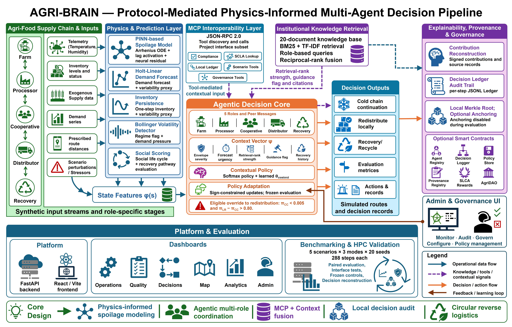

<h1 align="center">AGRI-BRAIN</h1>

<p align="center"><strong>Protocol-Mediated Decision-Level Interoperability through Context Injection<br>in Physics-Informed Multi-Agent Systems</strong></p>

<p align="center">
  <a href="https://github.com/kprodigi/AGRI-BRAIN/actions/workflows/ci.yml"></a>
  <a href="LICENSE"></a>
</p>

AGRI-BRAIN links observations, predictions, tool outputs and retrieved evidence to bounded routing-policy adjustments and inspectable decision records. This repository holds the code and evidence of a simulation study on a synthetic spinach cold chain. The study compares a fixed cold-chain reference (Static), a state-based adaptive policy without context injection (No-Context) and the full system (AGRI-BRAIN). The repository also contains a completed weight-sensitivity study, all figures, and scripts to verify and recompute the reported results.

## Architecture



*AGRI-BRAIN decision pipeline. Telemetry is transformed into physical-state features φ(s). MCP tool outputs and institutional-knowledge retrieval indicators form the context vector ψ, whose bounded contribution modifies the state-based routing policy. Actions pass a governance override and are linked to structural explanations and Merkle-rooted provenance; episode roots may optionally be anchored to a permissioned ledger. The dashboards, web frontend and optional smart contracts shown in the diagram are not included in this repository.*

## Study design

| Mode | Decision mechanism | Tool and retrieval injection | Peer influence | Adaptation |
|---|---|---|---|---|
| Static | Fixed cold-chain reference | No | No decision influence | None |
| No-Context | State-based adaptive policy with observations, forecasts and social shaping | No | No | Three episodes |
| AGRI-BRAIN | Same base-policy architecture plus bounded context adjustments | Yes | Yes | Three episodes |

No-Context also disables context-linked governance, so the comparison measures the configured context-enabled system with its coupled mechanisms rather than a single additive term. All modes share the outcome equations, and each adaptive evaluation freezes its learned parameters.

The primary analysis uses 20 seeds, five scenarios and three modes: **300 evaluation endpoints**. The two adaptive modes contribute 600 adaptation episodes and 200 frozen evaluations. The 100 Static evaluations were retained from an earlier run and verified against the current environmental identities and outcome equations (`data/primary/static_compatibility.json`). Static timing is not a controlled three-way speed comparison.

## Results at a glance

Mean Adaptive Resilience Index (ARI) over 20 seeds. Intervals are 95% BCa intervals of the paired seed differences.

| Scenario | Static | No-Context | AGRI-BRAIN | Paired gain over No-Context [95% BCa] | Relative gain |
|---|---|---|---|---|---|
| Heatwave | 0.401 | 0.526 | 0.548 | +0.0215 [0.0199, 0.0234] | +4.08% |
| Overproduction | 0.409 | 0.542 | 0.563 | +0.0215 [0.0192, 0.0242] | +3.97% |
| Cyber outage | 0.446 | 0.583 | 0.603 | +0.0204 [0.0189, 0.0219] | +3.50% |
| Adaptive pricing | 0.501 | 0.630 | 0.657 | +0.0267 [0.0245, 0.0287] | +4.24% |
| Baseline | 0.523 | 0.654 | 0.683 | +0.0290 [0.0260, 0.0309] | +4.44% |
| **Overall** (equal-scenario mean) | 0.456 | 0.587 | 0.611 | +0.0238 [0.0223, 0.0252] | +4.06% |

AGRI-BRAIN scores higher than No-Context in every scenario and for all 20 seeds in each (one-sided exact Wilcoxon tests, Holm-adjusted p = 4.8 × 10⁻⁶). The exact test cannot return a smaller p-value with 20 seeds, so the p-value reflects unanimity rather than effect size.

The weight-sensitivity study covers 23 settings with all three modes executed at each: 2,300 tasks, 20,700 episodes and 6,900 evaluations. The overall paired ARI gain stays between 0.0219 and 0.0258, the lower end of every pointwise 95% interval stays above 0.0204, and no setting reverses the ranking. The weights change the size of the gain (by at most 0.002 ARI), so the result supports robustness within the tested ranges, not independence from the weights.

All outcomes are simulated under the declared scoring assumptions. They are not field performance and not proof of optimal routing.

## Repository layout

```text
.
├── agribrain/       Application source: backend, frontend, Solidity contracts
├── analysis/        Recompute the primary statistics; regenerate two figures; export the dashboard's results data
├── data/
│   ├── primary/     Endpoints, paired gains, reported tables, decision records, validation evidence
│   └── sensitivity/ 6,900 endpoints, effective parameters, route changes, paired comparisons
├── docs/            Data guide, reproduction guide, provenance, architecture diagram
├── figures/         Final figures with captions and data sources
├── hpc/             Slurm scripts and validators for the primary run
├── mvp/             Simulator, spoilage-model assets and primary-run scripts
├── provenance/      Source hashes, distribution changes, raw-archive information
├── reproduction/    Simulation engine, locked dependencies, execution harness and run scripts
├── scripts/         verify_package.py: integrity and consistency checks
├── validation/      Interface and frozen-control scripts
├── CITATION.cff
├── FILE_HASHES.json SHA-256 of every distributed file
└── LICENSE
```

## Quick start

```bash
git clone https://github.com/kprodigi/AGRI-BRAIN.git
cd AGRI-BRAIN

# 1. Verify the supplied evidence (standard library only)
python scripts/verify_package.py

# 2. Recompute the primary statistics and compare them with the reported tables
python -m pip install -r analysis/requirements.txt
python analysis/primary_statistics.py

# 3. Regenerate the ARI performance and weight sensitivity figures
python analysis/make_figures.py --output figures_regenerated
```

Step 1 checks file hashes, coverage, numerical consistency and every link in the documentation. Steps 2 and 3 take under a minute and stop with an error if a recomputed value differs from the reported tables by more than 1e-9. None of these steps runs a simulation; see [Reproduction](docs/REPRODUCTION.md) for rerunning the experiments on a Slurm cluster.

The study engine in `reproduction/source` accepts only `static`, `no_context` and `agribrain`. The source under `agribrain/`, `hpc/` and `mvp/` comes from the evaluated commit; its mode registry also lists earlier ablation modes that are not part of this study. Internal historical field names remain where existing ledgers need them; they do not identify additional study modes.

## For reviewers

| Result | Where to check it |
|---|---|
| Overall outcomes and ARI by scenario (primary comparison) | `data/primary/three_mode_endpoints.csv`, `paired_seed_ARI.csv`, `overall_outcomes.json`; recomputed by `analysis/primary_statistics.py` |
| Executed routes | `data/primary/routing_time_analysis.json` |
| Individual decision examples | `data/primary/selected_decision_examples.json` |
| Ledger roots, contribution reconstruction, dominant-factor sign agreement | `data/primary/audit_summary.json`, `directional_disagreements.csv` |
| Interface invariance and malformed-input checks | `data/primary/validation_20260922/protocol_validation.json`; rerun with `validation/protocol_validation.py` |
| Frozen-policy controls | `data/primary/validation_20260922/control_summary.json`, `control_endpoints.csv`; rerun with `validation/run_all_controls.py` |
| Disturbance and policy timing | `data/primary/time_series_estimates.csv`, `pricing_analysis.json` |
| Weight sensitivity and effective weights | `data/sensitivity/`, `data/relocated_tables/`; figure recomputed by `analysis/make_figures.py` |
| Model, policy and retrieval implementation | `agribrain/backend/` (decision pipeline in [docs/ARCHITECTURE.md](docs/ARCHITECTURE.md)) |
| Complete adaptation and evaluation ledgers | Available on request (see Raw evidence) |

The interface and control reruns need the primary raw archive, which is available on request; [docs/REPRODUCTION.md](docs/REPRODUCTION.md) gives the steps. The protocol-preserved-context, executed-routing, decision-explanation and disturbance-timing figures are supplied as final images with their data; only the ARI performance and weight-sensitivity figures are regenerated by the scripts. See [figures/README.md](figures/README.md). The dashboard's Study results page shows these results from `agribrain/frontend/src/data/studyResults.json`, which `analysis/export_dashboard_data.py` derives from `data/` (continuous integration checks that they agree). Continuous integration also runs the backend, frontend and Solidity contract tests.

## Documentation

- [Data](docs/DATA.md): every data file, units and interval conventions.
- [Figures](figures/README.md): what each figure shows, its data and how to regenerate it.
- [Reproduction](docs/REPRODUCTION.md): verification, recomputation, and rerunning the experiments.
- [Provenance](docs/PROVENANCE.md): source identity and the changes made to it.
- [Architecture](docs/ARCHITECTURE.md) and [run guide](HOW_TO_RUN.md): the decision pipeline and how to run the application.

## Raw evidence

The complete adaptation and evaluation ledgers are large and are not hosted in this repository. They are available on request.

| Asset | Size | SHA-256 (first 16 characters) | Contents |
|---|---|---|---|
| `context_pair_20260914_193548_83c91ce_results.tar.gz` | 765 MiB | `d8d02c6f5f9ac11a` | Primary comparison: 200 evaluation ledgers, 600 adaptation ledgers, 800 episode archives, 57,600 routing choices, source and runtime records |
| `weights_20260924_180354_results_analysis.tar.gz` | 0.7 MiB | `a6ce9caec42d1b9f` | Compact analysis of the weight-sensitivity study |

Full checksums are in `provenance/raw_archives.json`. The compact sensitivity analysis is also distributed in this repository as `data/sensitivity/`. The complete sensitivity ledger archive (about 17 GB) is retained on the HPC system and is likewise available on request.

## Scope

Interface tests assess the tested transport paths and numerical invariance; they are not general protocol certification. Some malformed numerical values were accepted by the evaluated operating-envelope tool, and the normalization adapter is a separate test component. Frozen controls are within-policy diagnostics, whereas the primary comparison uses separately adapted modes. Audit reconstruction and explanation agreement are distinct checks. The supplied evidence includes unfavorable and null findings.

## Citation and license

Use GitHub's "Cite this repository" button or `CITATION.cff`, and cite the release tag or commit you used. The software is released under the [MIT license](LICENSE). No journal acceptance, publication DOI or release date is claimed.
