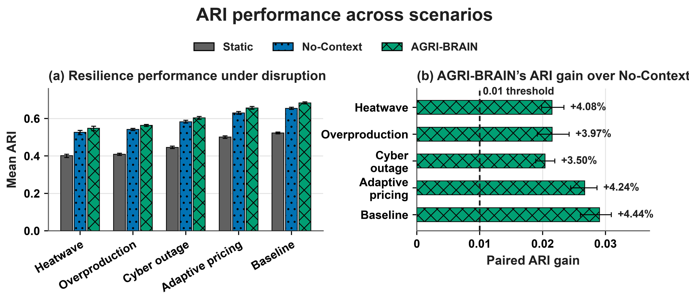
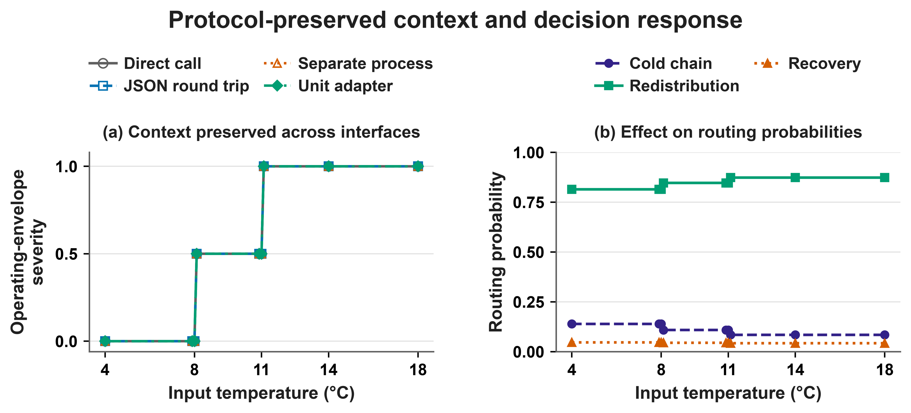
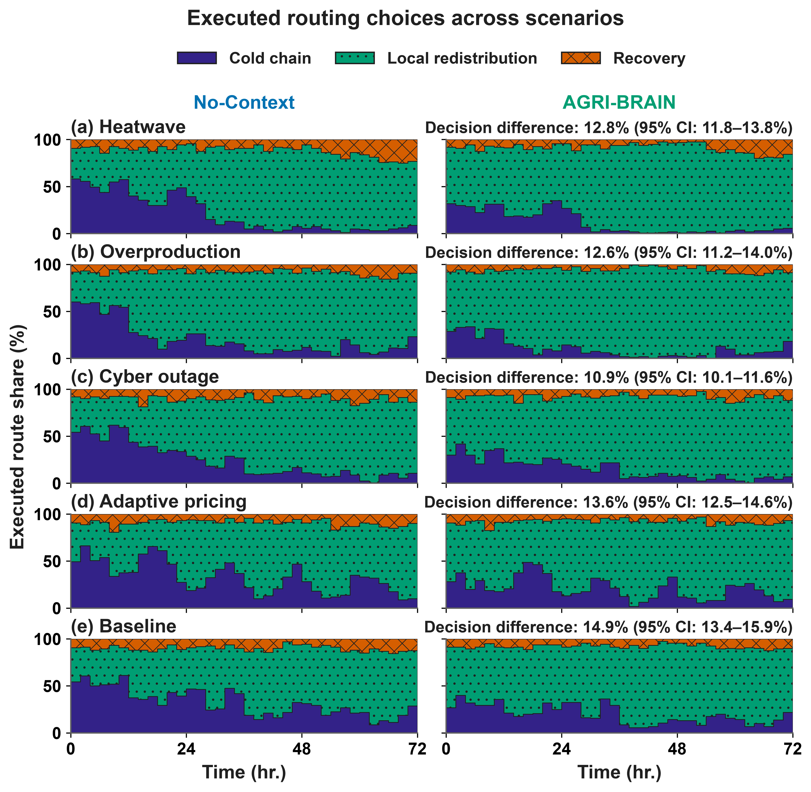
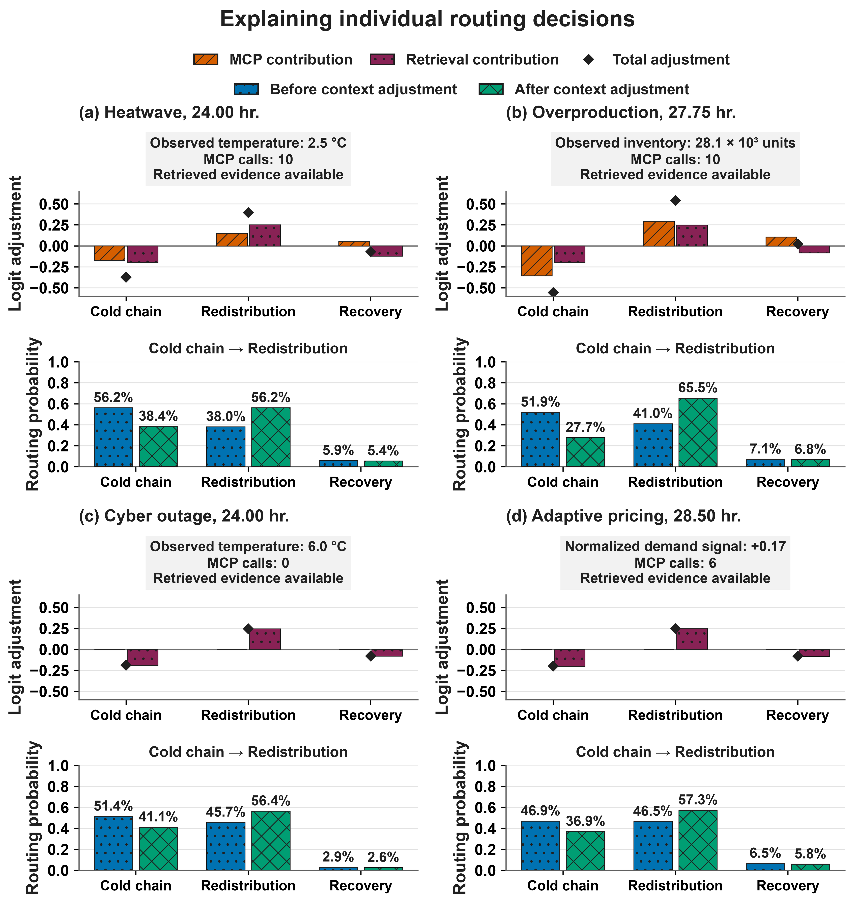
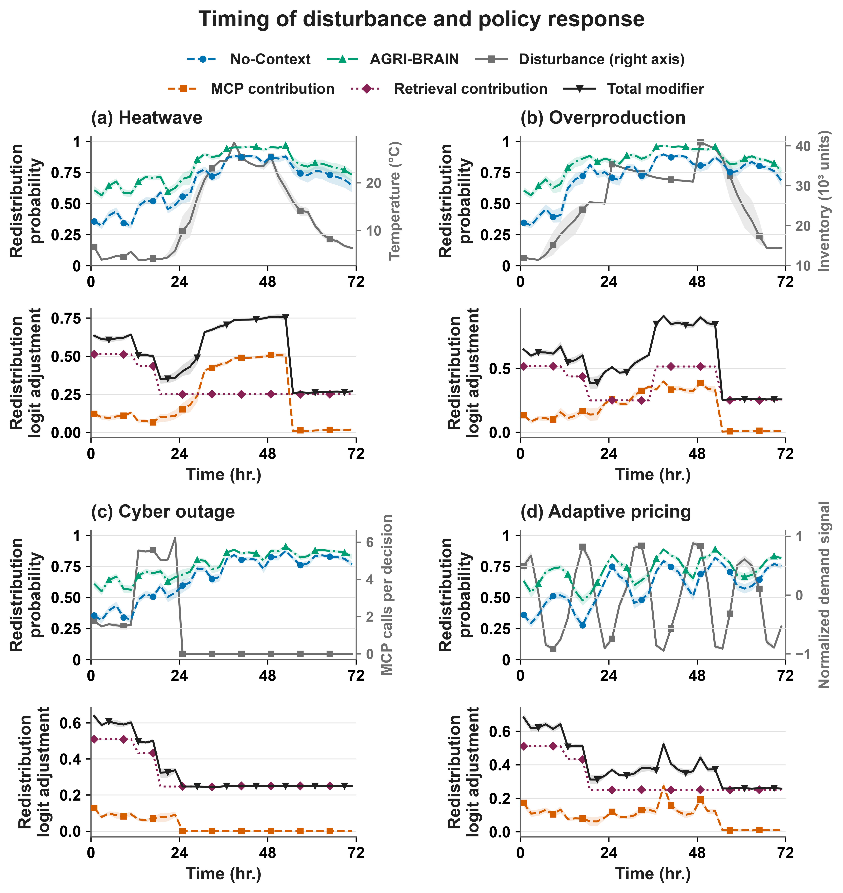
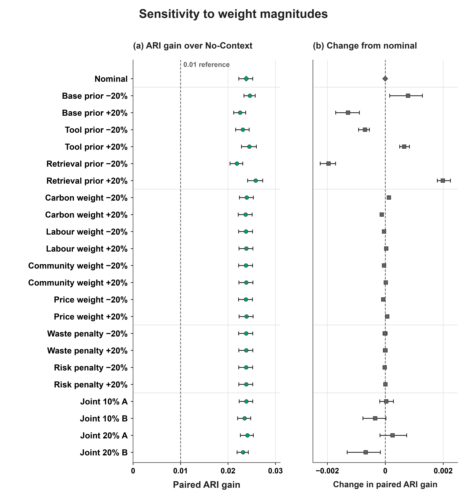

# Figures

Final figures of the study. The architecture diagram is [`docs/images/architecture.jpg`](../docs/images/architecture.jpg) and is shown in the [main README](../README.md). The captions, data sources and regeneration scripts below are also machine-readable in [`figure_index.json`](figure_index.json).

| Figure | File |
|---|---|
| [ARI performance across scenarios](#ari-performance-by-scenario) | `ari_performance_by_scenario.png` |
| [Protocol-preserved context and decision response](#protocol-preserved-context) | `protocol_preserved_context.png` |
| [Executed routing choices across scenarios](#executed-routing-choices) | `executed_routing_choices.png` |
| [Explaining individual routing decisions](#routing-decision-explanations) | `routing_decision_explanations.png` |
| [Timing of disturbance and policy response](#disturbance-and-policy-timing) | `disturbance_and_policy_timing.png` |
| [Sensitivity to weight magnitudes](#weight-sensitivity) | `weight_sensitivity.png` |

To regenerate the two figures that can be rebuilt from the supplied data, run from the repository root:

```bash
python -m pip install -r analysis/requirements.txt
python analysis/make_figures.py --output figures_regenerated
```

The script recomputes the plotted values from the raw endpoint files, compares them with the supplied tables, and draws the figures only if they match. The output is a re-rendering of the same data, not a byte copy of the files here. The other figures combine ledger-derived data with annotations.

<a id="ari-performance-by-scenario"></a>

## ARI performance across scenarios



Resilience across scenarios: (a) mean ARI and (b) paired gain over No-Context, with relative gains labeled. Whiskers show 95% BCa intervals across 20 seeds; 0.01 is a descriptive reference.

- File: `ari_performance_by_scenario.png`
- Data: [`data/primary/three_mode_endpoints.csv`](../data/primary/three_mode_endpoints.csv), [`data/primary/plotted_estimates.csv`](../data/primary/plotted_estimates.csv), [`data/primary/paired_seed_ARI.csv`](../data/primary/paired_seed_ARI.csv)
- Regenerable from the data: `python analysis/make_figures.py --output figures_regenerated` writes a re-rendering.

<a id="protocol-preserved-context"></a>

## Protocol-preserved context and decision response



Interface invariance and policy influence. (a) Equivalent tool inputs preserve severity across tested interfaces. (b) Routing probabilities under a primary-tool temperature sweep at one fixed state; other inputs and the cooperative modifier are held fixed.

- File: `protocol_preserved_context.png`
- Data: [`data/primary/validation_20260922/protocol_validation.json`](../data/primary/validation_20260922/protocol_validation.json)
- Supplied as a final image together with the data it uses; it is not regenerated here.

<a id="executed-routing-choices"></a>

## Executed routing choices across scenarios



Executed routes in the separately adapted policies, averaged in two-hour bins across 20 seeds. Annotations show matched-action disagreement with 95% BCa intervals.

- File: `executed_routing_choices.png`
- Data: [`data/primary/routing_time_analysis.json`](../data/primary/routing_time_analysis.json)
- Supplied as a final image together with the data it uses; it is not regenerated here.

<a id="routing-decision-explanations"></a>

## Explaining individual routing decisions



Verified cold-chain-to-redistribution switches with base policy, peer state, and random draw fixed, without overrides.

- File: `routing_decision_explanations.png`
- Data: [`data/primary/selected_decision_examples.json`](../data/primary/selected_decision_examples.json)
- Supplied as a final image together with the data it uses; it is not regenerated here.

<a id="disturbance-and-policy-timing"></a>

## Timing of disturbance and policy response



Redistribution probabilities (left axes), disturbance signals (right axes), and context contributions below. Lines show 20-seed means; ribbons show pointwise 95% bootstrap intervals.

- File: `disturbance_and_policy_timing.png`
- Data: [`data/primary/time_series_estimates.csv`](../data/primary/time_series_estimates.csv), [`data/primary/pricing_analysis.json`](../data/primary/pricing_analysis.json)
- Supplied as a final image together with the data it uses; it is not regenerated here.

<a id="weight-sensitivity"></a>

## Sensitivity to weight magnitudes



Weight sensitivity: (a) paired ARI gain over No-Context and (b) change from nominal, with pointwise 95% BCa intervals across 20 seeds. The 0.01 line is descriptive.

- File: `weight_sensitivity.png`
- Data: [`data/sensitivity/paired_ari_sensitivity.csv`](../data/sensitivity/paired_ari_sensitivity.csv), [`data/sensitivity/seed_endpoints.csv`](../data/sensitivity/seed_endpoints.csv)
- Regenerable from the data: `python analysis/make_figures.py --output figures_regenerated` writes a re-rendering.
